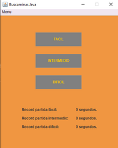
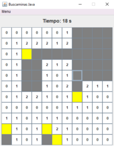
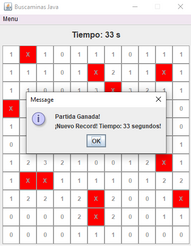

# Buscaminas Java

Clon del clásico juego Buscaminas de Windows, escrito en lenguaje Java con la bibloteca swing para la interfaz gráfica.

### Modo de juego

El juego consta de tres niveles de dificultad los cuales estan seteados de manera que la densidad 
de minas no exceda el 20% del tablero.

Implementa todas las funciones del juego original, inluyendo las opciones de marcar casillas 
como mina con el boton derecho del mouse y del despejado de zona clickeando una casilla ya revelada
cuando a su al rededor esta marcadas las casillas con minas correctas.

Posee el algoritmo para revelado automatico de casillas vecinas de una casilla sin minas alrededor, 
las cuales están marcadas con el número 0.

Cada partida cuenta con el display del cronómetro para llevar registros de las mejores marcas de tiempo
para cada nivel de dificultad.
NOTA: El registro vuelve a cero al reiniciar la aplicación, aun esta pendiente la función de guardado 
de datos del usuario en algún archivo del sistema.

### Instalación

[Descargar Instalador (.exe)](./instalador%20windows/Buscaminas-Java-1.0.exe)

### Licencia

Aplicación desarrollada con fines prácticos y de estudio totalmente libre para su uso.

### Clonar repositorio

git clone https://github.com/dariobralo/buscaminas-java.git

### Contacto del desarrollador

dariobralo@gmail.comn
